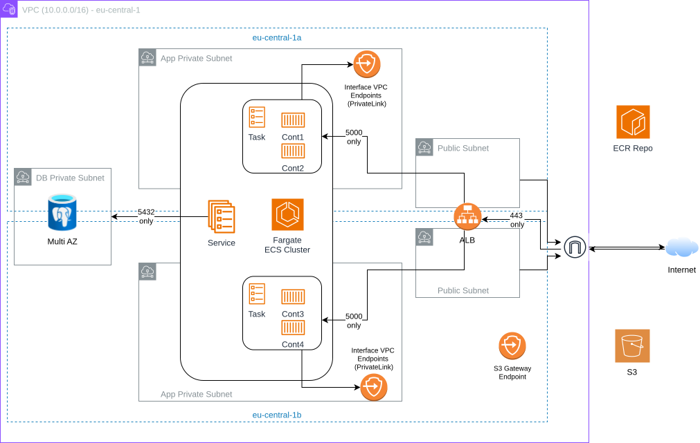

# AWS Two-Tier Architecture

This repository is a Terraform-first portfolio project that demonstrates AWS architecture and Infrastructure-as-Code implementation.

The Flask app is a minimal scope application (a tiny blog) used to exercise the infrastructure. The “product” here is the AWS design and Terraform implementation.

## What this showcases

- **Terraform module design** with environment wrappers (`dev`/`prod`) and a separate bootstrap for remote state.
- **Two-tier AWS architecture**: public edge + private compute + private database.
- **ECS Fargate in private subnets** behind an **internet-facing ALB**.
- **No NAT Gateway design**: private workloads reach AWS APIs via **VPC Endpoints (PrivateLink + S3 gateway endpoint)**.
- **Security fundamentals**: least-privilege security groups, encrypted RDS, Secrets Manager, TLS via ACM, Route 53 DNS.
- **Operational baseline**: CloudWatch logs, alarms (SNS email), dashboard widgets, ALB access logs to S3.
- **CI/CD pipeline**: GitHub Actions **OIDC role** builds, scans with Trivy, pushes to ECR, and deploys ECS task definition revisions (no long-lived AWS keys).

## Architecture

High-level flow:

```
Internet
	|
	v
Route 53 (A/ALIAS)
	|
	v
ALB (public subnets)  :80 -> 301 -> :443 (ACM)
	|
	v
ECS Fargate service (private app subnets)
	|
	v
RDS PostgreSQL (private db subnets, Multi-AZ)
```

Key design choices:

- **Private compute, public entrypoint**: the ALB is public; ECS tasks do not have public IPs.
- **NAT-less private networking**: ECS tasks access ECR, CloudWatch Logs, Secrets Manager, STS, KMS via **Interface VPC Endpoints**, and S3 via a **Gateway VPC Endpoint**.
- **Tight egress** from the task security group: HTTPS to endpoints/S3, DNS to the VPC resolver, and PostgreSQL to RDS.
- **TLS by default**: HTTP redirects to HTTPS; ACM cert is DNS-validated in Route 53.



## What gets provisioned (Terraform)

The `two-tier-app` module builds:

- VPC, subnets across two AZs (public/app/db)
- Internet Gateway + public route table
- ALB (HTTP->HTTPS redirect, HTTPS listener, target group)
- Route 53 records + ACM certificate + DNS validation
- ECS Cluster + Task Definition + Service (Fargate) + autoscaling (CPU + memory)
- ECR repository (scan on push + lifecycle policy)
- RDS PostgreSQL instance (encrypted, Multi-AZ)
- Secrets Manager secrets (DB password + Flask `SECRET_KEY`)
- VPC Endpoints (ECR API/DKR, Logs, Secrets Manager, KMS, STS + S3 gateway)
- CloudWatch log group, optional alarms + SNS topic + dashboard
- Optional ALB access logs bucket (encrypted, versioned, blocked public access)
- IAM role for GitHub Actions to push images to ECR and deploy ECS via OIDC

## Repository layout

```
app/                       # Reference Flask app (containerized)
	Dockerfile
	source/
		app.py
		requirements.txt
		templates/ static/

infra/
	bootstrap/               # S3 Object Lock backend for Terraform remote state
	environments/
		dev/                   # Environment wrapper around the module
		prod/
	modules/
		two-tier-app/          # Re-usable module that provisions the stack
```

## Prerequisites

- Terraform (tested with modern 1.x)
- AWS account + permissions to create VPC/ECS/ALB/RDS/IAM/Route53/ACM/etc.
- A Route 53 hosted zone you control (for ACM DNS validation + ALB alias record)
- A GitHub repository with GitHub Actions enabled (recommended path: build/push to ECR via OIDC)

Optional:

- Docker + AWS CLI if you prefer to build/push images manually from your workstation.

## Deploy (dev/prod)

### 1) (Recommended) Bootstrap remote state

This creates:

- S3 bucket for Terraform state (versioning + encryption + public access blocked)
- S3 Object Lock enabled at bucket creation with a 1-day default governance retention

From `infra/bootstrap/`:

```bash
terraform init
terraform apply
```

Note: the bootstrap S3 bucket uses `prevent_destroy = true` on purpose.

### 2) Configure backend for an environment

From `infra/environments/dev/` (repeat similarly for `prod/`):

```bash
cp backend.hcl.example backend.hcl
```

Edit `backend.hcl` if you changed the bootstrap project/region, ensure the `key` is unique per environment.

Then:

```bash
terraform init -backend-config=backend.hcl
```

### 3) Configure variables

```bash
cp terraform.tfvars.example terraform.tfvars
```

Fill in at least:

- `github_org`, `github_repo` (for the GitHub OIDC role trust policy)
- `domain_name`, `route53_zone_name`
- `alarm_email` (you must confirm the SNS subscription email)

### 4) Build + deploy the app image with GitHub Actions + OIDC

The module creates the ECR repository, ECS service, and an initial task definition. After that, GitHub Actions owns application releases: it pushes a SHA-tagged image, renders a new ECS task definition revision from the existing task definition family, and updates the ECS service.

From `infra/environments/dev/`:

```bash
# Create ECR, ECS, and the GitHub Actions deploy role
terraform apply

# Capture outputs for your GitHub workflow variables
terraform output -raw ecr_repository_url
terraform output -raw github_actions_role_arn
terraform output -raw ecs_cluster_name
terraform output -raw ecs_service_name
terraform output -raw ecs_task_execution_role_arn
```

This repository includes a workflow at `.github/workflows/ci-cd.yml` that:

- Runs Ruff and pytest checks
- Builds the Docker image from `app/Dockerfile`
- Scans the built image with Trivy
- On pushes to `main`, assumes the dev OIDC role, tags and pushes the same scanned image to dev ECR, registers a new ECS task definition revision, and updates the dev ECS service
- Optionally promotes an existing SHA-tagged image from dev ECR to prod ECR through a manual `workflow_dispatch` run

Configure these GitHub **Environment variables** for the `dev` environment:

- `AWS_REGION` (e.g. `eu-central-1`)
- `AWS_ACCOUNT_ID` (12-digit account ID)
- `OIDC_ROLE_ARN` (dev Terraform output: `github_actions_role_arn`)
- `ECR_REPO` (e.g. `two-tier-app-dev`)
- `ECS_CLUSTER` (dev Terraform output: `ecs_cluster_name`)
- `ECS_SERVICE` (dev Terraform output: `ecs_service_name`)
- `ECS_TASK_FAMILY` (e.g. `two-tier-app-dev-task`)
- `ECS_CONTAINER_NAME` (e.g. `two-tier-app-dev`)

If you provision prod, configure these GitHub **Environment variables** for the `prod` environment:

- `AWS_REGION`
- `AWS_ACCOUNT_ID`
- `OIDC_ROLE_ARN` (prod Terraform output: `github_actions_role_arn`)
- `SOURCE_ECR_REPO` (e.g. `two-tier-app-dev`)
- `ECR_REPO` (e.g. `two-tier-app-prod`)
- `ECS_CLUSTER` (prod Terraform output: `ecs_cluster_name`)
- `ECS_SERVICE` (prod Terraform output: `ecs_service_name`)
- `ECS_TASK_FAMILY` (e.g. `two-tier-app-prod-task`)
- `ECS_CONTAINER_NAME` (e.g. `two-tier-app-prod`)

The workflow publishes dev tags:

- `:main`
- `:sha-<git sha>`

Dev ECS deploys the immutable `:sha-<git sha>` tag for the commit that passed CI and Trivy. Terraform ignores ECS service `task_definition` drift so future app deployments are not rolled back by normal infrastructure applies.

Prod promotion is optional and cost-conscious. To promote an image, open GitHub Actions, run the `ci-cd` workflow manually, set `promote_prod` to `true`, and provide the Git SHA without the `sha-` prefix. The workflow copies `sha-<git sha>` from dev ECR to prod ECR, also tags it as `prod`, and deploys that same image to prod ECS. The prod environment can require manual approval in GitHub Environment protection rules.

### 4b) Build + push manually (optional)

If you want to push from your workstation instead of GitHub Actions:

```bash
ECR_REPO_URL=$(terraform output -raw ecr_repository_url)

# Use the same region you configured in terraform.tfvars
AWS_REGION=eu-central-1

# Login to ECR
aws ecr get-login-password --region "$AWS_REGION" | \
	docker login --username AWS --password-stdin "${ECR_REPO_URL%/*}"

# Build and push
docker build -t "$ECR_REPO_URL:dev" ../../app
docker push "$ECR_REPO_URL:dev"
```

Then set `ecr_image_uri` in `terraform.tfvars` to `${ECR_REPO_URL}:dev`.

### 5) Apply the full stack

```bash
terraform apply
```

After it completes, Terraform outputs include:

- `alb_https_url` (the main entrypoint)
- `ecr_repository_url`
- `cloudwatch_log_group`
- `github_actions_role_arn`

Tip: `terraform output` shows the full list (some outputs like the RDS endpoint are marked sensitive).

## App behavior

The app is a small Flask + SQLAlchemy blog:

- On startup it creates the `posts` table if missing.
- In AWS, DB connection details are injected via environment variables and Secrets Manager.

This is intentionally minimal: no migrations, no auth, no advanced features.

## Security & ops notes

- **RDS is private** (`publicly_accessible = false`) and encrypted at rest.
- **Secrets** are generated and stored in Secrets Manager.
- **ECS tasks have no public IPs**, and are reachable only via the ALB.
- **CloudWatch**: logs are shipped to a log group with retention; alarms and a dashboard can be toggled via variables.
- **Container scanning**: GitHub Actions scans the built image with Trivy before any ECR push or ECS deployment. The pipeline blocks fixable critical vulnerabilities; unfixed base-image CVEs are kept visible in scanner output and remediated when upstream fixes become available. Prod promotion, when used, copies the exact SHA-tagged image from dev ECR instead of rebuilding it.
- **ALB access logs** are stored in S3 (encrypted + versioned + public access blocked).

## Destroy / cleanup

From the environment folder (e.g. `infra/environments/dev/`):

```bash
terraform destroy
```

Bootstrap resources (state bucket + lock table) are intentionally long-lived. If you truly want to remove them, you must first remove/adjust `prevent_destroy` in `infra/bootstrap/backend.tf`.

## Cost warning

This stack can incur real AWS costs (ALB, Fargate tasks, RDS Multi-AZ, VPC Interface Endpoints, CloudWatch, S3 logs). Use small instance sizes for demos and destroy when done.